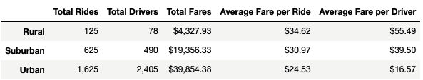
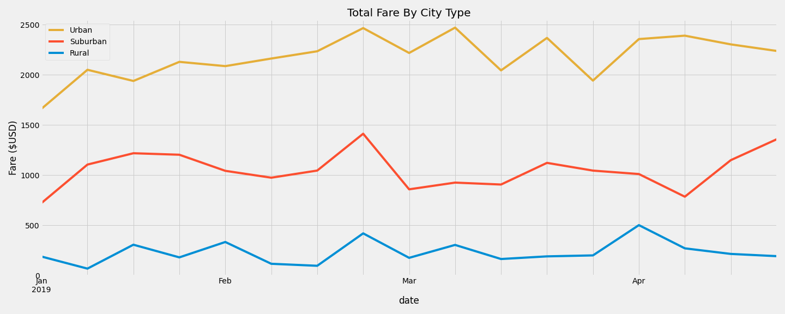

# PyBer_Analysis
## Overview
### Purpose
PyBer has asked me to analyze their ride-sharing data in order to improve access to their ride-sharing services and determine affordability for underserved neighborhoods. I evaluated how the data differs by city type (rural, suburban, urban) and detailed how the disparities can be used by PyBer to shape business decisions going forward.

## Results

### Availability and Demand
The DataFrame above represents the sum of the total fares in each city type each week from 1/1/19 to 4/29/19. The biggest stand-out is the availability of drivers in the three city types. Urban cities accounted for over 80% of the total PyBer drivers in the country. Additionally, Urban cities dominated the total amount of rides accounting for almost 70% of all PyBer rides taken. The availability of PyBer's services or other similar services in urban cities could surely be factor in urban cities having the lowest average fare per ride, but more research must be done to determine if there is correlation or causation between these two factors. The fact that suburban and rural cities trail so far behind urban cities in both total drivers and rides could very simply be a product of lesser demand for PyBer's services, which then has an impact on average fare per ride and average fare per driver.

### Average Fare per Ride
I find the average fare per ride values for each city type to be interesting. The comparison of average fare per ride among the city types is quite complicated because there are many potential external factors that may have an effect on the fare. To name a few, urban cities may lead to more people not owning a car and relying on services like PyBer's and also, more competition in the ride-sharing space in urban cities may lead to a more market competitive fare for rides. Something that benefits urban city PyBer drivers is the higher concentrations of people in an area compared to a rural or suburban city. Distance could be another factor in determining average fare per ride as the city types differ in landmass.

### Average Fare per Driver
Rural cities accounted for the highest ratio of total rides to total drivers among the city types, which benefits the driver. In the DataFrame, rural cities had the highest fare per driver and highest fare per ride, while urban cities ranked last in both. The questions becomes now: are the high average fare rates in rural cities because of the lack of availabilty of drivers? This again shows that the availability and demand for PyBer's services could be two of the most crucial factors for PyBer's business decisions going forward. 

### Urban Domination

Urban cities account for the vast majority of the total fares, while Suburban cities made up the middle tier and rural cities produced the least by a significant margin. Differences in lifestyle between the three city types could be a potential cause for the disparities in total fare between the city types.

## Summary
After conducting this analysis, I have three business recommendations for the PyBer CEO:
 1. With car prices so high at this current moment, people may decide not to have their own car and use services like PyBer instead. More research into whether or not people are getting rid of their cars for PyBer or other similar apps will prove very beneficial. One factor that would sway a person into deciding not to own a car would be the availability of PyBer drivers. If one does not have to worry about the possibility of not being able to find a ride at any given time, then they may feel more willing to live without owning or leasing a car and rely on PyBer.

 2. I would recommend looking into being able to provide more rides in rural cities to decrease the fare per ride. The scarcity of drivers in these cities increases the fare and may discourage people from using PyBer more regularly. More research must be done before implementation, but by providing more drivers and a resulting lower fare price, rural and even suburban cities may generate more profit for PyBer.

 3. Urban cities are the source of the majority of revenue to this point, so I believe that increased marketing efforts in these cities would prove fruitful. Urban cities tend to promote the increased use of public transportation and with Covid-19 still impacting life around the world, PyBer might be a more trusted and safe transportation option for people. Additionally, nightlife is more prevalent in urban cities, which leads to people needing a safe ride home. Exploring marketing strategies with these scenarios in mind may prove to be beneficial for PyBer.