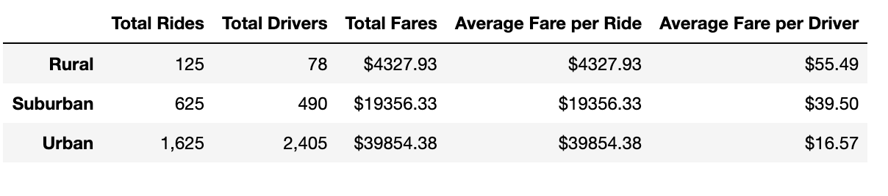

# PyBer_Analysis
## Overview
### Purpose
PyBer has asked me to analyze their ride-sharing data in order to improve access to ride-sharing services and determine affordability for underserved neighborhoods. I summarized how the data differs by city type (rural, suburban, urban) and detail how the disparities can be used by PyBer to shape business decisions going forward.

## Results

#### Availability
The DataFrame above represents the sum of the fares made in each city type each week from 1/1/19 to 4/29/19. The biggest stand-out is the availability of drivers in the three city types. Urban cities accounted for over 80% of the total PyBer drivers in the country. Additionally, Urban cities dominated the total amount of rides accounting for almost 70% of all PyBer rides taken. The availability of PyBer's services in urban cities could surely be factor in urban cities having the lowest total fare, but more research must be done to determine if there is correlation or causation. 

The comparison of average fare per ride among the city types is quite complicated because there are many potential external factors that may have an effect on the price. To name a few, urban cities may contribute to more people not owning a car and relying on servies like PyBer's or more competition in the ride-sharing space in urban cities may lead to a more market competitive fare for rides. Something that benefits urban city PyBer drivers is the higher concentrations of people in an area compared to a rural or suburban city.

Suburban

Rural cities accounted for the highest ratio of total rides to total drivers among the city types, which benefits the driver. In the DataFrame, rural cities had the highest fare per driver and highest fare per ride showing again that availability could be one of the crucial factors for PyBer going forward. 

The graph above visualizes the total fares per week in each city type. Urban cities jump out as generating the highest weekly fares per city type.

## Summary
After conducting this analysis, I have three business recommendations for the PyBer CEO:
 1. With car prices so high at this moment, people may decide to use services like PyBer instead. More research into whether or not people are ditching their cars for PyBer or other similar apps will prove very beneficial. One factor that would sway a person into deciding not to own a car would be the availability of PyBer drivers. If one does not have to worry about the possibility of not being able to find a ride at any given time, then they may feel more willing to live without owning or leasing a car and rely on PyBer.

 2. I would recommend looking into being able to provide more rides in rural cities to decrease the fare per ride. The scarcity of drivers in these cities increases the fare and may discourage people from using PyBer more regularly. More research must be done before implementation, but by providing more drivers and a lower fare price, rural and even suburban cities may generate more profit for PyBer.

 3. Urban cities are the source of the majority of revenue to this point, so I believe that increased marketing efforts in these cities would prove fruitful. Urban cities tend to promote the increased use of public transportation and with Covid-19 still impacting life around the world, PyBer might be a more trusted and safe transportation option for people. Additionally, nightlife is more prevalent in urban cities, which leads to people needing a safe ride home. Marketing strategies with these scenarios in mind may prove to be beneficial for PyBer.